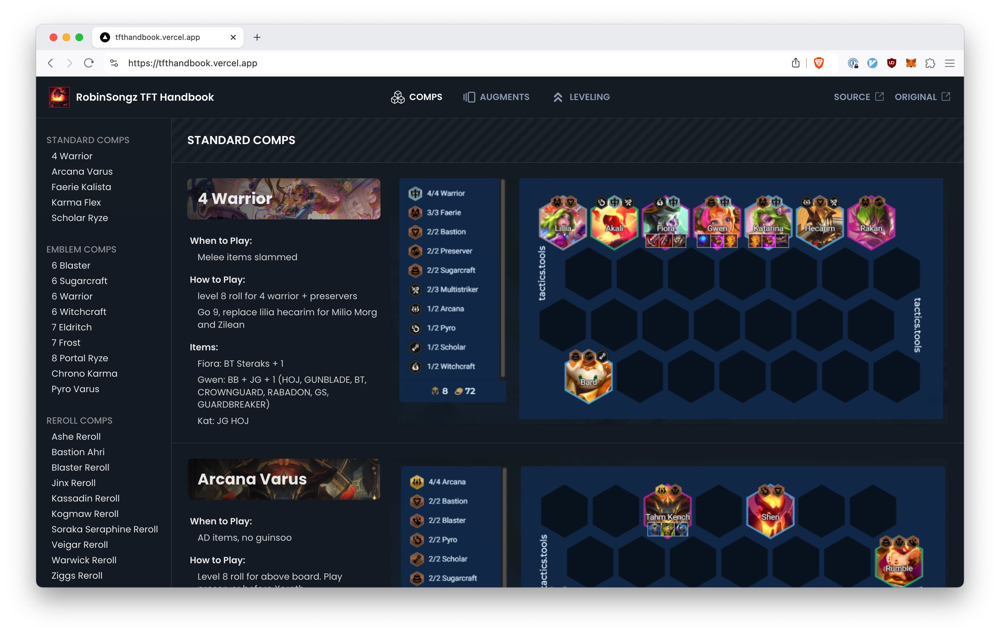
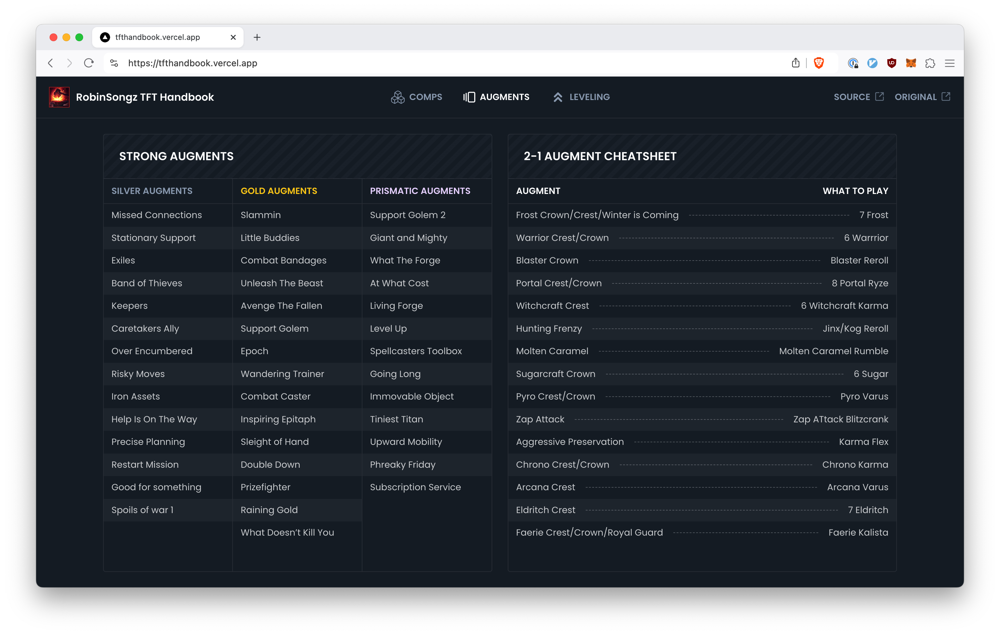
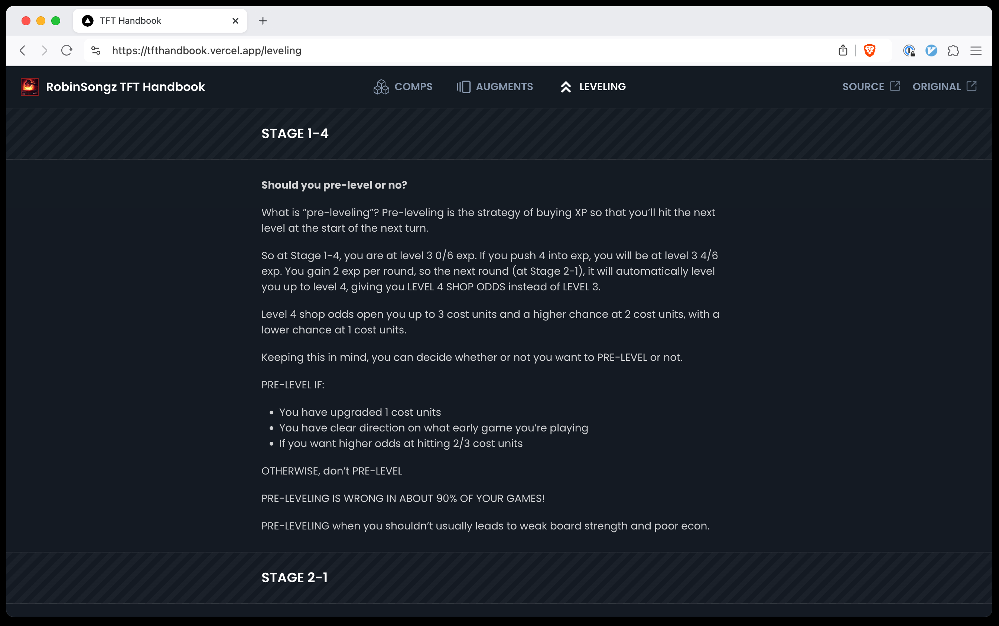

# TFT Handbook

This is a revamp of the [TFT Handbook](https://tfthandbook.com/) by RobinSongz.
It makes it nicer looking and easier to navigate.

A public instance of this is deployed here:
[**tfthandbook.vercel.app**](https://tfthandbook.vercel.app)

Tech stack:

- [Scraper](src/handbook/scrape.ts) to pull data from website as JSON
- Website data stored as a JSON string in Redis
- Vercel cron job to run the scraper every day
- Next.js app to display handbook

## Setup

The app uses Vercel for storage, so to even run it locally you'll need to:

- Fork the repo
- Set up a Vercel project linked to the repo
- Add Vercel KV to your project, use the same one for dev/staging/prod

This should be enough for Vercel to deploy, but you'll need to wait for the cron
job to fetch the handbook data. To to manually fetch it, or run the app locally,
clone your forked repo and link your local folder to the Vercel project:

```bash
bun install -g vercel
cd your-cloned-repo
vercel link
vercel env pull .env.development.local
```

To trigger a scrape locally (it'll write to the same Redis instance as
production):

```bash
bun install
bun run cli/fetch-handbook.ts
```

To run the app locally:

```
bun dev
```

## Screenshots






